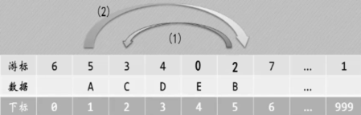

# 1 线性表(List)的定义

有零个或多个数据元素组成的有限序列，若元素存在多个，则第一个元素无前驱，最后一个元素无后继，其他元素都有一个前驱和后继。当元素个数为0时，称为空表。


# 2 线性表的抽象数据类型

```bash
ADT List 
{
Data :
数据对象：D={ai | ai∈ElemSet, i=1,2,…,n,  n≥0}
数据关系：R={R1},R1={<ai-1,ai>|ai-1,ai∈D, i=2,3,…,n }
基本操作:
  InitList(&L)
    操作结果：构造一个空的线性表L
  DestroyList(&L)
    初始条件：线性表L已存在
    操作结果：销毁线性表L
  ClearList(&L)
    初始条件：线性表L已存在
    操作结果：将线性表L重置为空表
  ListEmpty(L)
    初始条件：线性表L已存在
    操作结果：若L为空表,则返回TRUE,否则返回FALSE
  ListLength(L)
    初始条件：线性表L已存在
    操作结果：返回线性表L中数据元素的个数
  GetElem(L, i , &e)
    初始条件：线性表L已存在, 1≤ i≤ ListLength(L)
    操作结果：用e返回L中第i个数据元素的值
  LocateElem(L, e, compare( ))
    初始条件：线性表L已存在,compare()是数据元素的判定函数
    操作结果：返回L中第1个与e满足关系compare() 的数据元素的位序。若这样的元素不存在,则返回值为0
  PriorElem(L, cur_e ,&pre_e)
    初始条件：线性表L已存在
    操作结果：若cur_e是L的数据元素,且不是第一个,则用pre_e返回它的前驱,否则操作失败,pre_e无定义
  NextElem(L, cur_e ,&next_e)
    初始条件：线性表L已存在
    操作结果：若cur_e是L的数据元素,且不是最后一个,则用next_e返回它的后继,否则操作失败,next_e无定义
  ListInsert(&L, i, e)
    初始条件：线性表L已存在,1≤i≤ListLength(L)+1
    操作结果：在L中第i个位置之前插入新的数据元素e,L的长度加1
  ListDelete(&L, i, &e)
    初始条件：线性表L已存在,1≤i≤ListLength(L)
    操作结果：删除L的第i个数据元素,并用e返回其值,L的长度减1
  ListTraverse(L, visit( ))
    初始条件：线性表L已存在
    操作结果：依次对L的每个数据元素调用函数visit( )。一旦visit( )失败,则操作失败
}ADT List
```

# 3 线性表的顺序表示和实现（顺序表）

是指用一段地址连续的存储单元依次存储线性表的数据元素。

## 3.1 线性表顺序存储结构的优缺点

**优点**：

* 无需为表示表中元素之间的逻辑关系而增加额外的存储空间

* 可以快速地存储表中任意位置的元素(随机存储特点)

**缺点**：

* 插入和删除操作需要移动大量元素
* 当线性表长度变化较大时，难以确定存储空间的容量
* 容易造成存储空间的“碎片”

```c
// 方案一
#define  MAXSIZE  100
typedef  struct{
   ElemType elem[MAXSIZE];  /*存储空间*/
   int length;              /*当前长度*/
}SqList_static;

// 方案二
#define  LIST_INIT_SIZE  100        /*存储空间的初始分配量*/
#define  LIST_INCREMENT_SIZE  10    /*存储空间的分配增量*/
typedef  struct{
   ElemType *elem;  /*存储空间的基址*/
   int size;        /*当前分配的存储容量*/
   int length;      /*当前长度*/
}SqList;
```

**方案一缺点**：

* LIST_SIZE过小，则会导致顺序表上溢
* LIST_SIZE过大，则会导致空间的利用率不高
* 插入操作效率低

**方案二缺点**：

有时间和空间代价的：当因插入元素而空间不足时，需要重新分配比原先的顺序表多存储LISTINCREMENT个数据元素的连续空间，并且需要将原空间的数据元素复制到新分配的空间中(注意，这个复制过程是很耗时的)。

* 必须记录当前线性表的实际分配的空间大小；
* 当线性表不再使用时，应释放其所占的空间；
* 这种方法要求实现级的语言能提供空间的动态分配与释放管理。

**方案二优点**：
> 这种方法可以解决方案一中的“上溢”问题和“空间利用率不高”问题。 


# 4 线性表的链式存储结构（链表）

是指用一组任意的存储单元存储线性表的数据元素，这组存储单元可以存在内存中未被占用的任意位置。这里引用了指针，通过指针来维系元素间的关系，即每个指针指向其下一个元素。
因此，在插入和删除的时候，可以不用移动大量数据，但是由于每个节点都需要多加一个空间指向下个位置，可能造成存储空间的浪费。
    
把存储数据元素信息的域称为数据域，把存储直接后继位置的域称为指针域。这两部分信息组成数据元素称为存储映像，称为**结点**(Node)。

## **4.1 单链表**
    每个结点中只包含一个指针域的链表，称为单链表。链表的第一个结点的存储位置叫做头指针，最后一个结点指为空(NULL)。常见的单链表有两种：带头结点和不带头结点。

### 头指针和头结点的区别：

头指针是必要的，常用头指针冠以链表名字，而头结点（头空结点）则是方便链表的操作而设立的，可以没有。  


### **4.1.1 单链表的定义**

```c
typedef int ElemType;
typedef struct LNode
{
   ElemType  data;       // 数据域
   struct LNode *next;   // 指针域
}LNode, *LinkList;

```

### **4.1.2 单链表的常用操作**

**单链表的读取**

由于链表个元素之间的逻辑关系是靠每个结点的指针域指向来维持的，因此在查找第i个元素是需要从头开始找，并同时记录查找个数和i是否相等，因此，这个算法的时间复杂度为取决于i的位置，因此，最坏的情况为O(n)。  
这个过程的核心思想是“工作指针后移”，这也是很多算法的常用技术。

**单链表的插入**
```
S->next = p->next;
P->next = s;
```

 **单链表的删除**

```c
q = p->next;
P->next = q->next;
free(q);
```

**单链表的整表销毁**

从头遍历并销毁

**单链表的整表操作**

A. 头插法创建单链表：算法简单，但生成的链表结点的次序和输入的顺序相反。  
B. 尾插法创建单链表：在插入过程中，维持一个尾指针。  
 

**单链表结构与顺序表存储结构优缺点**

我们从存储分配方式、时间性能和空间性能三方面来做对比。

> 存储分配方式：
> * 顺序结构使用一段连续的存储单元依次存储线性表的数据元素
> 但链表采用链式存储结构，用一组任意的存储单元存放线性表的元素。

> 时间性能：
> * 查找：顺序存储结构O(1)，单链表O(n)
> * 插入和删除：顺序存储结构O(n)，单链表为O(1)

> 空间性能：
> * 顺序存储结构需要预分配存储空间，分大了浪费，分小了，容易造成溢出。
> * 单链表，动态分配结构

**综上所诉：**  
若线性表需要频繁查找，很少进行插入和删除操作，宜采用顺序存储结构，反之，则宜采用链式存储结构。当线性表中元素个数变化较大或不确定表长时，最好采用单链表结构，这样可以不需要考虑存储空间的大小问题。如果事先知道线性表的大致长度，这种用顺序存储结构效率会高很多。
 

## **4.2 静态链表**

  通过定义一个结构体数组实现类型于“链表”结构的形式，即为数组中每一个元素附加一个连接指针，从而形成静态链表结构。这种描述方法叫做游标实现法.  
线性表的静态链表存储结构：
```c
#define MAXSIZE 100
typedef struct
{
    ElemType  data; // 数据
    int   cur;   // 游标（Cursor）
}SNode, StaticLinkList[MAXSIZE];
```



注意：

1. 我们对数组的第一个和最后一个元素做特殊处理，他们的data不存放数据
1. 最后一个元素的游标指向第一个有数据元素的下标（相当于单链表中头结点作用，为0时说明此时静态链表为空）；而且链表的最后一个元素的游标是0。
3. 第一个元素的游标指向第一个没有数据的下标。(即指向备用链表)


**静态链表的初始化**
```c
Status InitStaticList(StaticLinkList space) { //静态链表的初始化
  int  i;
  for(i=0; i < MAXSIZE - 1; i++)
    space[i].cur = i + 1 ;
  space[MAXSIZE-1].cur=0;
  //最后一个的游标指向第一个有元素的下标（=0时链表为空）
  return OK;
}
```

**静态链表的遍历**  
(略)

**静态链表的插入操作**

在动态链表中，是通过malloc和free实现结点的申请和释放，而在静态链表中，需要我们编写代码仿照malloc和free在静态链表中实现类似功能实现，为了解决数组中哪些分量未被使用，我们使用将所有未被使用的及已被删除的游标链成一个备用链表。

```c
//在静态链表的位置i插入元素e
Status StaticListInsert(StaticLinkList L, int i, ElemType e){
     int x;
     int k = MAXSIZE -1; //头指针
     if( i < 1 || i > ListLength(L)+1 ) //超出范围
          return ERROR;
     x = malloc_SLL( L);
     if( x == 0) //申请空间失败
          return ERROR;
     while( --i)
          k = L[ k].cur;
    
     L[ x].data = e;
     L[ x].cur = L[ k].cur;
     L[ k].cur = x;
     return OK;
}
```

**静态链表的删除操作**
```c
//删除在L中第i个元素
Status StaticListDelete(StaticLinkList L，int i)
{
     int j，k;
     if( i<1 || i>ListLength(L) )
          return ERROR;
     k = MAXSIZE -1;
     for(j = 1; j <= i - 1; j++)
          k = L[ k].cur; //前一个
     j = L[ k].cur; //j记录要释放的下标
     L[ k].cur = L[ j].cur;
     free_SLL( L，j);
     return OK;
}
```


## **4.3 单循环链表**
    单循环链表是另一种形式的链式存储结构（简称循环链表）。它将单链表中最后一个结点的指针指向链表的头结点，是整个链表头尾形成一个环形。
在实际应用中，类似普通的单链表类型，但是在判断时，到尾判断有等于NULL改为等于head指针。
除了常规的格式外，还可以根据实际操作对结构进行一定的变化，来进行结构变化。
例如：需要经常对两个链表进行合成操作的，可以将原来设置的头指针head改变为设置成终端尾指针rear，这样就能操作灵活性，大大减低算法复杂度。
 
## **4.4 双向链表**
单链表只有一个指向后继的指针来表示结点间的逻辑关系，故从任一结点访问其后继结点很方便，但要朝其前驱结点比较困难。双向结点用两个指针表示结点见的逻辑关系。即增加一个指针指向其直接前驱，这样形成的链表有两条不同方向的链，即前驱和后继，因此称为双向链表。


--双向链表的插入过程：
```
S->prior=p->prior;
S->next=p;
P->prior=s;
S->prior->next=s;
```

--双向链表的删除过程：
```
P->next=q->next;
q->next->prior=p;
Free(q);
```
注意：双向链表的插入和删除在最尾端时需要做一些特别的处理。
 
## **4.5 循环双链表**  
（略）
 

# **5 线性表的应用**

## 5.1 约瑟夫问题（循环链表） 
约瑟夫问题（原）：N个人围成一圈，从第一个开始报数，第M个将被杀掉，最后剩下一个，其余人都将被杀掉。例如N=6，M=5，被杀掉的人的序号为5，4，6，2，3。最后剩下1号。
 
## 5.2 魔术师发牌问题（循环链表）
魔术师利用一副牌中的13张黑牌，预先将他们排好后叠放在一起，牌面朝下。对观众说：“我不看牌，只数数就可以猜到每张牌是什么，我大声数数，你们听，不信？现场演示。”魔术师将最上面的那张牌数为1，把他翻过来正好是黑桃A，将黑桃A放在桌子上，第二次数1，2，将第一张牌放在这些牌的下面，将第二张牌翻过来，正好是黑桃2，也将它放在桌子上这样依次进行将13张牌全部翻出，准确无误。  
问题：牌的开始顺序是如何安排的？  
解：见代码。
 
## 5.3 拉丁方阵问题
拉丁方阵是一种n×n的方阵，方阵中恰有n种不同的元素，每种元素恰有n个，并且每种元素在一行和一列中恰好出现一次。著名数学家和物理学家欧拉使用拉丁字母来作为拉丁方阵里元素的符号，拉丁方阵因此而得名。  
例如下图是一个3×3的拉丁方阵：  
1	2	3  
2	3	1  
3	1	2  
 
 
## 5.4 判断单链表是否有环