# 1 树

## 1.1 定义

**树（Tree）** 是 n（n>=0）个结点的有限集（记为T），当n=0时称为空树，在任意一棵非空树中：

* 有且仅有一个结点没有前驱，称为根节点（Root）
* 当n>1时，其余结点可分为m（m>0）个**互不相交**的有限集T1、T2、.....、Tm，其中每一个集合本身又是一棵树，并且称为根的子树（SubTree）   

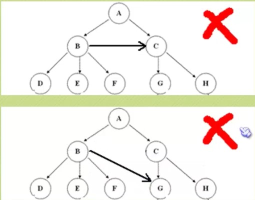  

**树的基本术语：**

(1)树中每一个元素（图中的圆点）称为**树的结点**。

<font clolor=red>结点拥有的子树数目</font> 称为**结点的度**（Degree），**整棵树的度**取树内**各结点的度的最大值**。
--度为0的结点称为**叶子结点**（Leaf）或**终端结点**
--度不为0的结点称为**分支结点**或非终端结点，除根结点外，分支结点也称为**内部结点**。  

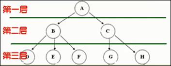 


(2)孩子(Child)和双亲(Parent)
结点的子树的根称为结点的孩子（Child），相应的，该结点称为孩子的双亲（Parent），同一双亲的孩子之间互称为兄弟（Sibling），其双亲兄弟的孩子称为堂兄弟。

(3)**结点的层次和高度**
树中结点的最大层次称为树的深度（Depth）或高度。（含跟节点，上图中树的深度或高度为3）

(4)如果将树中结点的各子树看成从左至右是有次序的，不能互换的，则称该树为有序树，否则称为无序树。

(5)**森林**是m（m>=0）棵互不相交的树的集合。对树中每个结点而言，其子树的集合即为森林。


## 1.2 树的抽象数据类型
```c
ADT Tree{ 
Data：
    D是具有相同特性的数据元素的集合。  
数据关系R： 
    若D为空集，则称为空树； 
    若D仅含有一个数据元素，则R为空集，否则R={H}，H是如下二元关系： 
      (1) 在D中存在唯一的称为根的数据元素root，它在关系H下无前驱；  
      (2) 若D-{root}≠NULL，则存在D-{root}的一个划分D1，D2，D3， „，Dm(m>0)，对于任意j≠k(1≤j，k≤m)有Dj∩Dk=NULL，且对任意的i(1≤i≤m)，唯一存在数据元素xi∈Di有<root，xi>∈H; 
      (3) 对应于D-{root}的划分，H-{<root，xi>，„，<root，xm>}有唯一的一个划分H1，H2，„，Hm(m>0)，对任意j≠k(1≤j，k≤m)有Hj∩Hk=NULL，且对任意i(1≤i≤m)，Hi是Di上的二元关系，(Di，{Hi})是一棵符合本定义的树，称为根root的子树。 
    
基本操作P： 
  InitTree(&T); 
    操作结果：构造空树T。
  DestroyTree(&T); 
    初始条件：树T存在。 操作结果：销毁树T。 
  CreateTree(&T，definition); 
    初始条件：definition给出树T的定义。 操作结果：按definition构造树T。 
  ClearTree(&T); 
    初始条件：树T存在。 操作结果：将树T清为空树。 
  TreeEmpty(T); 
    初始条件：树T存在。 操作结果：若T为空树，则返回TRUE，否则返回FALSE。 
  TreeDepth(T); 
    初始条件：树T存在。 操作结果：返回Ｔ的深度。 
  Root(T); 
    初始条件：树T存在。 操作结果：返回T的根。 
  Value(T，cur_e); 
    初始条件：树T存在，cur_e是T中某个结点。 操作结果：返回cur_e的值。 
  Assign(T，cur_e，value); 
    初始条件：树T存在，cur_e是T中某个结点。 操作结果：结点cur_e赋值为value。 
  Parent(T，cur_e); 
    初始条件：树T存在，cur_e是T中某个结点。 
    操作结果：若cur_e是T的非根结点，则返回它的双亲，否则函数值为“空”。 
  LeftChild(T，cur_e); 
    初始条件：树T存在，cur_e是T中某个结点。 
    操作结果：若cur_e是T的非叶子结点，则返回它的最左孩子，否则返回“空”。 
  RightSibling(T，cur_e); 
    初始条件：树T存在，cur_e是T中某个结点。 
    操作结果：若cur_e有右兄弟，则返回它的右兄弟，否则返回“空”。 
  InsertChild(&T，&p，I，c); 
    初始条件：树Ｔ存在，ｐ指向Ｔ中某个结点，1≤i≤p指结点的度＋１，非空树ｃ与Ｔ不相交。 
    操作结果：插入c为Ｔ中ｐ指结点的第ｉ棵子树。 
  DeleteChild(&T，&p，i); 
    初始条件：树T存在，p指向T中某个结点，1≤i≤p指结点的度。
    操作结果：删除Ｔ中ｐ所指结点的第ｉ棵子树。 
  TraverseTree(T，visit()); 
    初始条件：树T存在，visit是对结点操作的应用函数。 
    操作结果：按某种次序对T的每个结点调用函数visit()一次且至多一次。一旦visit()失败，则操作失败。
}ADT Tree
```

在双亲表存储结构中添加以下基本抽象数据类型： 
`Status Print(PTree T);` 
附加函数：用于显示树的所有内容。 初始条件：树T存在； 
操作结果：将树T的所有结点显示出来。 
在双亲表存储结构中，`TraverseTree(T，visit())`函数是按层次次序对T的每个结点进行访问的。

## 1.3 树的表示 
树的逻辑表示方法有多种，常见以下4种：  
1）树形图表示法  
2）嵌套集合表示发（文氏图表示法）  
3）凹入表示法  
4）广义表表示法  
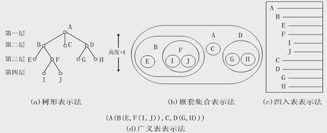  

## 1.4 树的存储结构
  **树的顺序存储**适合**树中结点比较“满”的情况**，例如满二叉树或者完全二叉树或则其他比较满的树，**对于一般的树用顺序存储结构是非常浪费存储空间的**。在实际应用中，常用链式存储方式来表示树。
树的常用存储方法有：双亲存储方式、孩子链表表示法和孩子兄弟链表表示法。
<font color=red>（注意：存储结构的设计是不固定的，在不同实际应用情况使用不同存储结构，这里只是参考而已)</font>

### 1.4.1 双亲存储表示法
双亲存储表示法（parent tree）一般采用顺序存储结构实现。即用一组连续的存储空间来存储树的结点，每个结点包括数据元素的值本身和指向结点双亲位置的指针（伪指针）。双亲存储表示法的定义如下：  
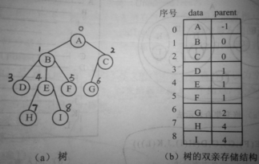  

```c
#define MAXTREESIZE 100
typedef char DataType;
typedef struct
{
   DataType  data;  //结点数据域
   int   parent; //双亲位置(伪指针)
}PTreeNode;

typedef struct
{
   PTreeNode   nodes[MAXTREESIZE];
   int   nodeCount;  //结点总数n 
   int  root; // 根结点的位置r
}PTree;
```
* 优点：容易计算出结点的双亲甚至祖先
* 缺点：难以获取结点的孩子结点(需遍历)

### 1.4.2 孩子链表表示法
孩子链表表示法（child tree）是把树中每个结点的孩子都排列起来，组成一个线性表，即孩子链表。  
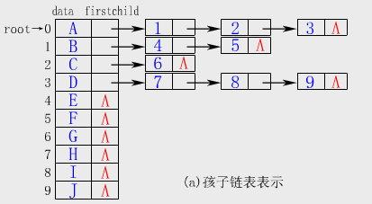  
```c
typedef struct CTNode  // 孩子链表节点
{ 
  int child; //孩子的下标
    Struct CTNode *next; // 下一个孩子
}* ChildPtr;

typdef struct    //表头结点
{
  DataType data;      // 存放结点中的数据
  ChildPtr firstchild;// 指向第一个孩子的指针
}CTBox;

typedef struct
{
  CTBox nodes[MaxTreeSize];
int n，r;//树的结点数n和根结点的位置r
}CTree;
```
--优点：易于实现孩子以及后代的运算
--缺点：与双亲结点的运算非常麻烦（需从头遍历）


### 1.4.3 双亲孩子链表存储
解决上述孩子链表表示法的缺点，结合双亲存储表示法的特点，提出下面的存储方式—— 双亲孩子链表存储方式（parent child tree）。(仅供参考)   
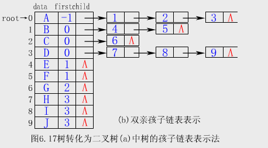  
```c
typdef struct 
{
  DataType data; // 存放结点中的数据
  int   parent;  // 存放双亲结点索引
  ChildPtr firstchild;// 指向第一个孩子的指针
}PCTreeNode;

typedef struct PCNode{ 
    int child; //孩子的下标
    Struct PCNode *next; // 下一个孩子
}*ChildPtr;

typedef struct
{
  PCTreeNode nodes[MaxTreeSize];
  int n，r;//树的结点数n和根结点的位置r
}PCTree;
```

### 1.4.4 孩子兄弟表示法
孩子兄弟表示法（child Sibling tree）也是树的一种链式存储结构。这种方法是为了每个结点设计3个域：  
一个数据域，两个指针域。其中一个指针域指向该结点的第一个孩子结点，另一个指向该结点下一个兄弟结点。  
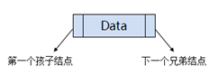  

孩子兄弟链表存储结构定义如下：

```c
typedef struct CSNode
{
    DataType data;
    Struct CSNode *firstchild; // 第一个孩子结点
    Struct CSNode *nextsibling; // 下一个兄弟结点
}CSNode, *CSTree;
```
* 优点：可以方便地实现树和二叉树的相互转换和树的各种操作  
* 缺点：查找当前结点的双亲结点比较麻烦，需要从树的跟结点逐个比较查找


# 2 二叉树
**二叉树是树的一种特例，是度为2的有序树。他的特点是每个结点至多有两棵子树。**

## 2.1 二叉树的定义和性质

二叉树是n（n>=0）个结点的有限集。它或者是空集（n=0）,或者同时满足一下两个条件：

（1）有且仅有一个根结点

（2）其余的结点分成两棵互不相交的左子树和右子树（次序不能颠倒）

**1）二叉树的5中基本形态**

空二叉树、只有根结点的二叉树、右子树为空的二叉树、做子树为空的二叉树、左右子树不为空的二叉树  
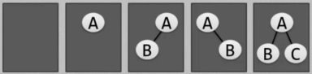  

**2）特殊的二叉树**  
**（1）斜树：**每个结点只有左子树（或右子树）,如下图：  
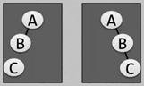  

**（2）满二叉树**  
**每一层上的结点的度**都达到最大值2，**且**叶结点都在最下面一层。**满二叉树一定是完全二叉树**。  

**（3）完全二叉树**  
--叶子结点只能出现在最下面两层  
--最下层的叶子一定集中在左部连续位置  
--只有最下面两层结点的度可以小于2,**倒数第二层若有叶子结点,一定都在左部连续位置**  
--如果结点度为1,则该结点只有左孩子  
--同样结点树的二叉树,完全二叉树的深度最小  
**注意：**满二叉树一定是完全二叉树，但完全二叉树不一定是满二叉树  

 **3）二叉树的性质**
（1）在二叉树的第i层上至多有2^(i-1)个结点（i>=1）  
（2）深度为k的二叉树至多有2^k -1个结点（k>=1）  

## 二叉树的抽象数据类型

```
ADT BinaryTree { 
数据对象D：
	D是具有相同特性的数据元素的集合.。
数据关系R：
	若D= ∅,则R={},称BinaryTree为空二叉树； 若D≠,则R={H},H是如下二元关系： 
	(1) 在D中存在惟一的称为根的数据元素root,它在关系H下无前驱；
	(2) 若D-{root}≠∅,则存在D-{root}={D1,Dr},且D1∩Dr=∅； 
	(3) 若D1≠∅,则D1中存在惟一的元素x1,<root,x1>∈H,且存在Dr上的关系Hr∈H；H={<root,x1>,<root,xr>,H1,Hr}； 
	(4) （D1,{H1}）是一棵符合本定义的二叉树,称为根的左子树,是一棵符合本定义的二叉树,称为根的右子树。 

基本操作P：
  InitBiTree(&T); 
	操作结果：构造空二叉树T。
  DestroyBiTree(&T); 
	初始条件：二叉树T存在。 操作结果：销毁二叉树T。 
  CreateBiTree(&T,definition); 
	初始条件：definition给出二叉树T的定义。 操作结果：按definition构造二叉树T。
  ClearBiTree(&T); 
	初始条件：二叉树T存在。 操作结果：将二叉树T清为空树。 
  BiTreeEmpty(T); 
	初始条件：二叉树T存在。 操作结果：若T为空二叉树,则返回TURE,否则FALSE。 
  BiTreeDepth(T); 
	初始条件：二叉树T存在。 操作结果：返回T的深度。 
  Root(T); 
	初始条件：二叉树T存在。 操作结果：返回T的根。 
  Value(T,e); 
	初始条件：二叉树T存在,e是T中的某个结点。 操作结果：返回e的值。 
  Assign(T,&e,value); 
	初始条件：二叉树T存在,e是T中的某个结点。操作结果：结点e赋值为value。 
  Parent(T,e); 
	初始条件：二叉树T存在,e是T中的某个结点。 
	操作结果：若e是T的非跟结点,则返回它的双亲,否则返回“空”。 
  LeftChild(T,e); 
	初始条件：二叉树T存在,e是T中的某个结点。 
	操作结果：返回e的左孩子。若e无左孩子,则返回“空”。 
  RightChild(T,e); 
	初始条件：二叉树T存在,e是T中的某个结点。 
	操作结果：返回e的右孩子。若e无右孩子,则返回“空”。 
  LeftSibling(T,e); 
	初始条件：二叉树T存在,e是T中的某个结点。 
	操作结果：返回e的左兄弟。若e无左孩子或无左兄弟,则返回“空”。 
  RightSibling(T,e);  
	初始条件：二叉树T存在,e是T中的某个结点。 
	操作结果：返回e的右兄弟。若e无右孩子或无右兄弟,则返回“空”。 
}endADT  BinaryTree 
```

## 2.3 二叉树的顺序存储结构

  **二叉树的顺序存储结构**是用一组地址连续的存储单元（一维数组）来存储树中的数据元素。为了能存储结构中反映出结点之间的逻辑关系,首先要对树中的每个结点进行编号,然后以结点的编号下标,把各结点的值对应存入一位数组的相应单元中.  
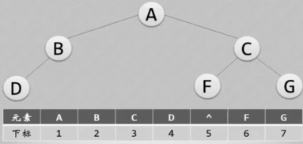  
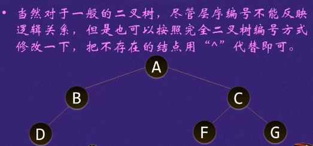  

  在实际使用上,二叉树的顺序存储结构一般应用在存储完全二叉树或比较满的树,如果是存储比较稀疏的树甚至是斜树,会造称存储空间的严重浪费。  
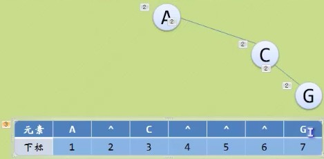  


## 2.4 叉树的链式存储结构

由于顺序存储的适用性不强，因此常用链式存储结构，**二叉链表**定义如下。
```c
typedef char DataType;  // 定义结点数据的类型
typedef struct BiTNode
{
    DataType data;  // 数据域 
    Struct BiTNode *lchild;  // 左子树
    Struct BiTNode *rchild;  // 右子树
}BiTNode,*BiTree;
```


## 2.5 二叉树的遍历

二叉树的遍历是值从根结点出发,**按照某种次序依次访问二叉树中所用结点**,使得每个结点被访问依次。

二叉树的遍历次序不同于线性结构,线性最多也分为顺序、循环、双向等简单的遍历方式。
但是，因为树结点之间不存在唯一的前驱和后继这样的关系，在访问一个结点后，下一个被访问的结点面临着不同的选择。**（这个过程可以有不同的方案）**

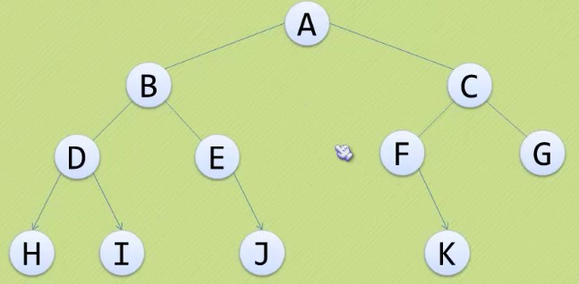  

二叉树的遍历方式可以很多,如果我们限制了从左到右的习惯方式,主要有以下**四种**：

**1）前序遍历(PreOrderTraverse)**：DLR

**=> ABDH##I##E#J##CF#K##G##**  

```c
void DLRVisit(BiTree *T)    // 前序遍历(DLR)
{
    if(*T != NULL) {
        printf("%c", (*T)->data);
        DLRVisit(&(*T)->leftChild);
        DLRVisit(&(*T)->rightChild);
    }
}
```

**2）****中序遍历(InOrderTraverse)**：LDR

**=> #H#D#I#B#E#J#A#FKC#G#**

```c
void LDRVisit(BiTree *T)    // 中序遍历(LDR)
{
    if(*T != NULL) {
        LDRVisit(&(*T)->leftChild);
        printf("%c", (*T)->data);
        LDRVisit(&(*T)->rightChild);
    }
}
```

**3）****后序遍历(PostOrderTraverse)**：LRD

=> HIDJEBKFGCA

```c
void LRDVisit(BiTree *T)    // 后序遍历(LRD)
{
    if(*T != NULL) {
        LRDVisit(&(*T)->leftChild);
        LRDVisit(&(*T)->rightChild);
        printf("%c", (*T)->data);
    }
}
```

**4)层序遍历**

**=> ABCDEFGHIJK**


## 2.6 创建二叉树

创建一棵二叉树，约定用户遵照某种方式输入数据（常用前序遍历[DLR]的方式，当然也可以使用其他顺序）。

```c
void CreateBiTree( BiThrTree *T )
{
    char c;
    scanf("%c", &c);
    if( '#' == c )
        *T = NULL;
    else{
        *T = (BiThrNode *)malloc(sizeof(BiThrNode));
        (*T)->data = c;
        CreateBiTree(&(*T)->lchild);
        CreateBiTree(&(*T)->rchild);
    }
}
```


## 2.2 二叉树的删除
二叉树的删除使用**后序遍历**，先删除左右子树，在删除结点。
```c
// 删除二叉树，使用后序遍历的顺序
void DeleteBiTree(BiTree* T) {
	if (*T != NULL) {
		DeleteBiTree(&(*T)->lchild);
		DeleteBiTree(&(*T)->rchild);	
		free(*T);
		*T = NULL;
	}
}
```

## 2.7 线索二叉树

  为什么提出线索二叉树呢？这是因为传统的二叉树在使用中大量浪费了存储空间（^），为了有效利用这些空的存储空间，可以指定原有的孩子指针为空的域来存放指向前驱和后继的信息,这样的指针被称为**“线索”**。加线索的过程称为**线索化****，**由此得到的二叉树称作**线索二叉树**。

**2.7.1 建立线索二叉树(二叉树线索化)**

  **二叉树线索化** 实质上就是遍历一棵二叉树。在遍历过程中,访问结点的操作是检查当前的左，右指针域是否为空，将左指针改为指向前驱结点，右指针改为指向后续结点。为实现这一过程，增加两个标志，设指针pre始终指向刚刚访问的结点，即若指针p指向当前结点，则pre指向它的前驱，以便设线索。  
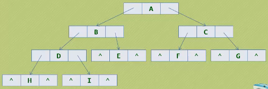  

以这个完全二叉树为例：

> （DLR）前序遍历：ABDH##I##E##CF##G##  
> （LDR）中序遍历：#H#D#I#B#E#A#F#C#G#  
> （LRD）后序遍历：##H##ID##EBFGCA  
发现，存在一些空间没有发生作用，所以，可以把上面的空余空间利用起来。  
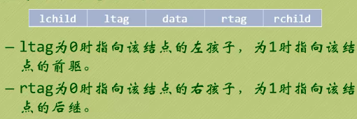  

代码如下：
```c
#include <stdio.h>
#include <stdlib.h>
typedef char ElemType;
// 线索存储标志位
// Link(0):表示指向左右孩子的指针
// Thread(1):表示指向前驱后继的线索
typedef enum { Link, Thread } PointerTag;

// 线索二叉树节点结构
typedef struct _BiThreadNode {
    char data;
    struct _BiThreadNode* lchild, * rchild;
    PointerTag ltag, rtag;
} BiThreadNode, * BiThreadTree;

// 创建一棵二叉树,约定用户遵照前序遍历的方式输入数据
void CreateBiTree(BiThreadTree* T){
    char c;
    scanf("%c", &c);
    if ('#' == c) {
        *T = NULL;
    }else{
        *T = (BiThreadNode*)malloc(sizeof(BiThreadNode));
        (*T)->data = c;
        (*T)->ltag = Link;
        (*T)->rtag = Link;
        CreateBiTree(&(*T)->lchild);
        CreateBiTree(&(*T)->rchild);
    }
}
// 全局变量，始终指向刚刚访问过的结点
BiThreadTree pre;

// 中序遍历线索化 LDR
void InThreading(BiThreadTree T)
{
    if (T){
        InThreading(T->lchild); //递归左孩子线索化 
        
        if (!T->lchild) { // 如果左孩子为空
            T->ltag = Thread;
            T->lchild = pre;  //lchild指向刚刚访问的结点
        }
        
        if (!pre->rchild){  // 如右孩子为空
            pre->rtag = Thread;
            pre->rchild = T;  //指向后继
        }
        pre = T;
        InThreading(T->rchild);     //递归右孩子线索化
    }
}

// 创建中序线索二叉树
void InOrderThreading(BiThreadTree* p, BiThreadTree T)
{
    *p = (BiThreadTree)malloc(sizeof(BiThreadNode));
    (*p)->ltag = Link;
    (*p)->rtag = Thread;
    (*p)->rchild = *p;  //初始化(要注意T为空情况)
    if (!T){
        (*p)->lchild = *p;
    }else{
        (*p)->lchild = T;
        pre = *p;
        InThreading(T);
        pre->rchild = *p;       //收尾操作
        pre->rtag = Thread;
        (*p)->rchild = pre;
    }
}

void visit(char c)
{
    printf("%c", c);
}

// 中序遍历二叉树,非递归
void InOrderTraverse(BiThreadTree T)
{
    BiThreadTree p;
    p = T->lchild;
    while (p != T){
        while (p->ltag == Link){
            p = p->lchild;
        }
        visit(p->data);
        while (p->rtag == Thread && p->rchild != T){
            p = p->rchild;
            visit(p->data);
        }
        p = p->rchild;
    }
}


int main()
{
    BiThreadTree P, T = NULL;
    CreateBiTree(&T);
    
    // 线索化
    InOrderThreading(&P, T);
    printf("中序遍历输出,结果为: ");
    InOrderTraverse(P);
    printf("\n");
    return 0;
}
```


## 2.8 树、森林与二叉树的转换

### 2.8.1树转换成二叉树

加线,在所有兄弟结点之间加一条连线。

去线,对树中每个结点,只保留它与第一孩子结点的连线,删除它与其他孩子结点之间的连线。

层次调整,以树的根结点为轴心,将整棵树顺时针旋转一定的角度,使之结构层次分明。

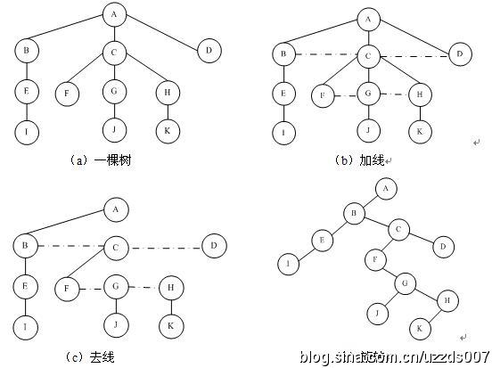

### 2.8.2 森林转化为二叉树

把每棵树转换为二叉树。

第一棵二叉树不动，从第二棵二叉树开始，依次把后一棵二叉树的根结点作为前一棵二叉树的根结点的右孩子，用线连接起来。  

### 2.8.3二叉树转化为树或森林

二叉树转换为普通树是刚才的逆过程,步骤也就是反过来做而已。

判断一棵二叉树能够转换成一棵树还是森林,标准很简单,那就是只要看这棵二叉树的根结点有没有右孩子,有的话就是森林,没有的话就是一棵树。

 

### 2.8.4 树跟森林的遍历

森林的遍历也分为**前序遍历**和**后序遍历**，其实就是按照树的先根遍历和后根遍历依次访问森林的每一棵树。

**我们的惊人发现：**

树、森林的前根（序）遍历和二叉树的前序遍历结果相同，树、森林的后根（序）遍历和二叉树的中序遍历结果相同！


## 2.9 二叉树的应用

### 2.9.1 二叉查找树
二叉查找树，又称为二叉搜索树，又成为二叉排序树  
二叉排序树要么是空二叉树，要么具有如下特点：
二叉排序树中，如果其根结点有左子树，那么左子树上所有结点的值都小于根结点的值；
二叉排序树中，如果其根结点有右子树，那么右子树上所有结点的值都大小根结点的值；
二叉排序树的左右子树也要求都是二叉排序树；

1） ** 使用二叉排序树查找关键字**
二叉排序树中查找某关键字时，查找过程类似于次优二叉树，在二叉排序树不为空树的前提下，首先将被查找值同树的根结点进行比较，会有 3 种不同的结果：  
如果相等，查找成功；  
如果比较结果为根结点的关键字值较大，则说明该关键字可能存在其左子树中；  
如果比较结果为根结点的关键字值较小，则说明该关键字可能存在其右子树中；  
实现函数为：（运用递归的方法）  

```c
BiTree SearchBST(BiTree T,KeyType key){
    //如果递归过程中 T 为空，则查找结果，返回NULL；或者查找成功，返回指向该关键字的指针
    if (!T || key==T->data) {
        return T;
    }else if(key<T->data){
        return SearchBST(T->lchild, key); //递归遍历其左孩子
    }else{
        return SearchBST(T->rchild, key); //递归遍历其右孩子
    }
}
```

2）**二叉排序树中插入关键字 **

3）**二叉排序树中删除关键字**

### 2.9.2 哈夫曼树与哈夫曼编码

**哈夫曼树**又称为**最优二叉树**或**最优搜索树**，是一种带权路径长度最短的二叉树。哈夫曼编码是首个实用的压缩编码方案，即使在今天的许多知名压缩算法里，依然可以见到哈夫曼编码的影子。 
赋给树中叶结点一个有某种意义的实数，称为该**结点的权。**  
树中每个叶子结点的路径长度之和，称为**树的路径长度**  
**从树根结点到该结点之间的路径长度与该结点上权的乘积** 称为**结点的带权路径长度**  
**树中所有叶子结点的带权路径长度之和**称为该**树的带权路径长度，简称WPL(Weighted paths length)**。  
WPL的值越小，说明构造出来的二叉树的性能越佳。当WPL最小时，称为**最优二叉树**。  
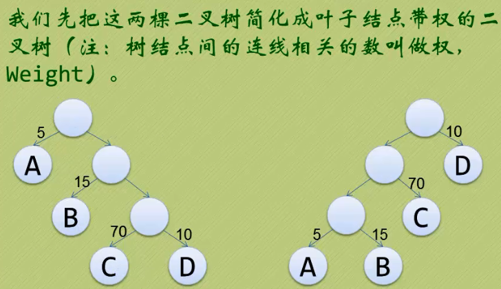  

**1. 说明**

1) 当叶子上权值相同时，完全二叉树一定是最优二叉树。否则完全二叉树不一定是最优二叉树。  
2) 在最优二叉树中，权值越大的叶子离根越近  
3) 最优二叉树形态不唯一，但WPL最小  

**2. 哈夫曼树的构造方法**  
1）在森林中选出两棵根节点的权值最小的二叉树  
2）合并两棵选出的二叉树，增加一个新结点作为新二叉树的根，权值为左右孩子的权值之和  
3）重复上述两个操作，直到构造成一棵树，结果是一棵哈夫曼树。  
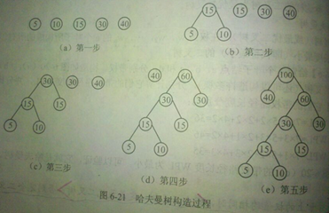  

**3. 哈夫曼编码**  

* 名词解释：定长编码、变长编码、前缀码  
* 变长编码：单个编码的长度不一致，可以根据整体出现的频率来调节  
* 前缀编码：就是没有任何码字是其他码字的前缀(哈夫曼编码就是一种前缀编码)  

**4. 代码实现**  

```c
typedef struct
{
    unsigned int weight;
    unsigned int parent,lchild,rchild;
}HTNode, *HuffmanTree; 
```