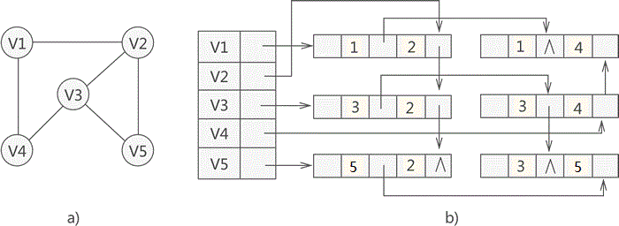
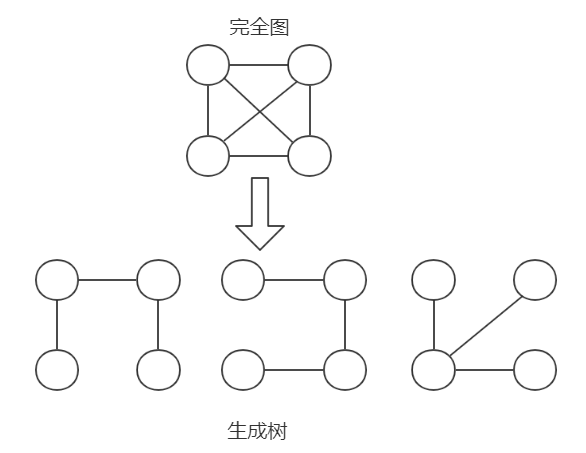
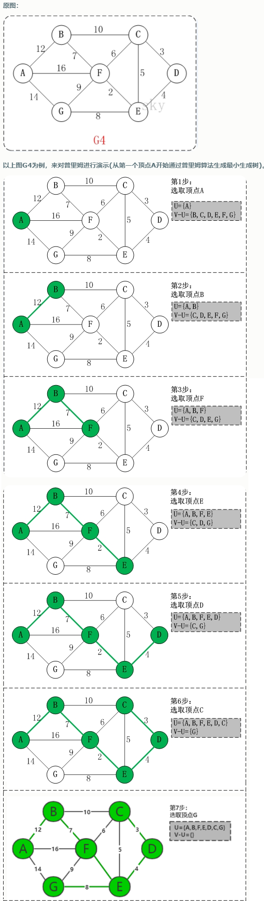
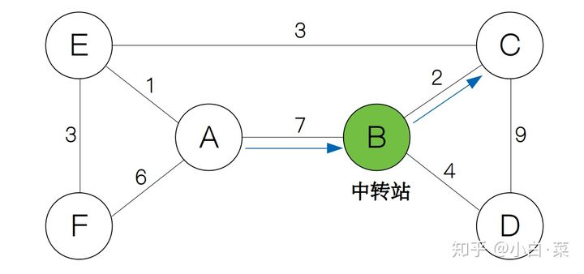
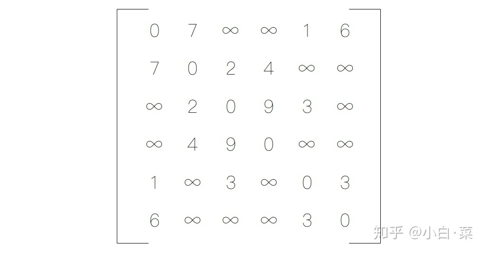
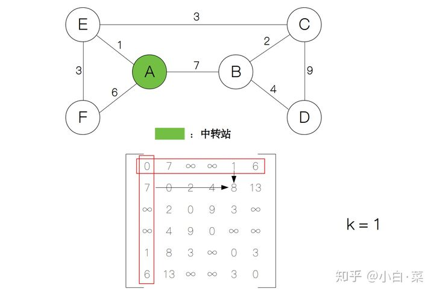
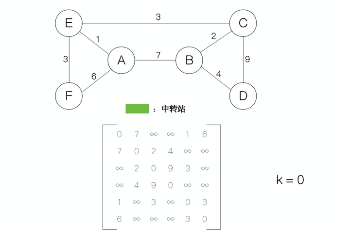

**图（Graph）**是由顶点的有穷非空集合和顶点之间边的集合组成，通常表示为：G（V，E），其中G表示一个图，V是图G中**顶点的集合**，E是图G中**边的集合**。  

翻译：  
边：Edge  
弧：Arc  
顶点：vertex  
图：graph  

需要注意的几个地方：  
* 线性表中我们把数据元素叫**元素(Elem)**，树中叫**结点(Node) **，在图中数据元素我们称之为**顶点(Vertex)**  
* 线性表中，相邻的数据元素之间具有线性关系，树结构中，相邻两层的结点具有层次关系，而图结构中，任意两个顶点之间都可能有关系，顶点间的逻辑关系用边来表示，边集可以是空的。  

# 1 图的定义和术语  
**无向边(Edge)**：若顶点Vi到Vj之间的边没有方向，则称这条变为无向边，用无序偶（Vi，Vj）来表示。  
**有向边(Arc)**：若从顶点Vi到Vj的边有方向，则称这条边为有向边，也称为**弧(Arc)**，用有序偶 <Vi，Vj> 来表示，Vi称为弧尾，Vj称为**弧头（箭头为头）**。   
**简单图：**不存在顶点到其自身的边，且同一条边不重复出现。  
**无向完全图：**在无向图中，如果任意两个顶点之间都存在边。含有n个顶点的无向完全图有n*(n-1)/2条边。  
  

**有向完全图：**如果任意两个顶点之间都存在互为相反的两条弧。含有n个顶点的有向完全图有n*(n-1)条边。  
  

**稀疏图和稠密图：**这里的稀疏和稠密是模糊概念，都是相对而言的，通常认为边或弧数小于**n*logn**(n是顶点的个数)的图称为**稀疏图**，反之称为**稠密图**。  

有些图的边或弧带有与它相关的数字，这种与图的边或弧相关的数叫做**权(weight)**，这种带权的图通常称为**网(network)**  
   

**子图(subgraph)：**假设有两个图G1 =(V1，E1)和G2=(V2，E2)，如果V2≦V1且E2≦E1，则称G2是G1的子图。

**顶点的度**  
无向图中，若有边(Vi，Vj)，则称Vi与Vj互为邻接点，(Vi，Vj)是与顶点Vi和Vj相关联的边。与顶点相关联边的条数，称为**顶点的度**。

有向图中，以顶点Vi为弧尾的弧个数，称为**顶点Vi的出度**，记为OD(Vi)，以顶点Vi为弧头的弧个数称为**顶点Vi的入度**，记为ID(Vi)。顶点Vi的度=OD(Vi)+ID(Vi)。

 

# 2 图的存储结构


## 2.1 邻接矩阵(MGraph)

**基本思想：对于有n个顶点的图，用一维数组vexs[n]  存储顶点信息，用二维数组 A[n] [n] 存储顶点之间关系的信息。该二维数组称为邻接矩阵。**

在邻接矩阵中，以顶点在vexs数组中的下标代表顶点，邻接矩阵中的元素A[i][j]存放的是顶点i到顶点j之间关系的信息。

### 2.1.1 无向邻接矩阵
  

```c
#define MaxVertexNum 100 // 最大顶点数，应由用户定义 
typedef char VertexType; // 顶点类型
typedef int EdgeType;  // 边上的权值类型
 
typedef struct
{
    VertexType vertexs[MaxVertexNum]; 			// 顶点表
    EdgeType edges[MaxVertexNum][MaxVertexNum]; // 邻接矩阵，可看作边表
    int numOfVertex;// 当前的顶点数
    int numOfEdge;  // 当前的边数
}MGragh;
```


### 2.1.2 有向邻接矩阵

  


## 2.2 邻接表和逆连接表(Adjacency List)
**邻接表(Adjacency List)**是图的一种链式存储结构，它既可以存放有向图也可以存放无向图。**它关注的是点**。  

### 2.2.1 无向邻接表

图中**顶点用一个一维数组存储**，当然，顶点也可以用单链表来存储，不过数组可以较容易地读取顶点信息，更加方便。  
图中每个顶点Vi的所有邻接点构成一个线性表，**由于邻接点的个数不确定，所以我们选择用单链表来存储**。  
  

无向邻接表的代码表示：
```c
#define MAX_VERTEX_NUM 20  // 最多顶点数
typedef char DataType;	   // 顶点保存数据的类型

// 边类型
typedef struct EdgeType {
	int	VertexIndex;		   // 顶点的下表
	struct EdgeType* nextEdge; // 指向下一条边
}EdgeType;

// 顶点类型
typedef struct VertexType {
	DataType data;
	EdgeType* firstEdge;	// 指向第一条边
}VertexType;

typedef struct {
	VertexType vertexs[MAX_VERTEX_NUM];
    int	numOfVertex; // 当前顶点数
    int numOfEdge;   // 当前边数
}ALGraph; // 无向图的邻接表
```


### 2.2.2 有向图的邻接表

若是有向图，邻接表结构也是类似的，把定点当弧尾建立的邻接表，这样容易得到每个顶点的**出度**。

  

对于**带权值**的网图，**可以在边表结点定义中再增加一个数据域来存储权值即可**。

  

有向图的邻接表的代码表示：
```c
#define MAX_VERTEX_NUM 20  // 顶点数
typedef char DataType;	   // 顶点保存数据的类型

// 弧类型
typedef struct ArcType {
	int	VertexIndex;		// 顶点的下表
    int Weight;				// 权值
	struct ArcType* nextArc; // 指向下一条弧
}ArcType;

// 顶点类型
typedef struct VertexType {
	DataType data;
	ArcType* firstArc;	// 指向第一条弧
}VertexType;

typedef struct {
	VertexType vertexs[MAX_VERTEX_NUM]; // 顶点集
	int	numOfVertex; // 当前顶点数
    int numOfArc;   // 当前弧数
}ALGraph; // 无向图的邻接表
```


### 2.2.3 有向图的逆邻接表

有时为了确定顶点的入度或以顶点为弧头的弧，我们可以建立一个有向图的逆邻接表。把定点当弧头建立的邻接表，这样容易得到每个顶点的**入度**

   


## 2.3 十字链表（有向图）
  **十字链表(Orthogonal List)**是**有向图**的另一种存储结构。可以看成是将**有向图**的邻接表和逆链接表结合起来得到的一种链表。

 在十字链表中，对应于有向图中每一条弧有一个结点，对应于每个顶点也有一个结点。

这些**顶点**的结构如下：
  

边表结点结构：
  

  

 

```c
#define MAX_VERTEX_NUM 20
typedef char DataType;

typedef struct ArcType {
	int tailVertex, headVertex;
	struct ArcType* tailLink, * headLink;
	int Weight; // 权值，如果需要保存跟多的信息则改成指针的形式
}ArcType;

typedef struct VertexType {
	DataType data;
	ArcType* firstIn;
	ArcType* firstOut;
}VertexType;

typedef struct {
	VertexType vertexs[MAX_VERTEX_NUM];
	int numOfVertex;
	int numOfArc;
}OLGraph;
```


## 2.4 邻接多重表（无向图）

无向图的存储可以使用邻接表，但在实际使用时，如果想对图中某顶点进行实操（修改或删除），由于邻接表中存储该顶点的节点有两个，因此需要操作两个节点。

为了提高在无向图中操作顶点的效率，本节学习一种新的适用于存储无向图的方法——邻接多重表。

独自为图中各顶点建立一张链表，存储各顶点的节点作为各链表的首元节点，同时为了便于管理将各个首元节点存储到一个数组中。  
 
图 1 邻接多重表各首元节点的结构示意图

图 1 中各区域及其功能为：
- data：存储此顶点的数据；  
- firstedge：指针域，用于指向同该顶点有直接关联的存储其他顶点的节点。  

 

 图 2 邻接多重表中其他节点结构


图 2 节点中各区域及功能如下：

- mark：标志域，用于标记此节点是否被操作过，例如**在对图中顶点做遍历操作时，为了防止多次操作同一节点，mark 域为 0 表示还未被遍历；mark 为 1 表示该节点已被遍历**；
- ivex 和 jvex：数据域，分别存储图中各边两端的顶点所在数组中的位置下标；
- ilink：指针域，指向下一个存储与 ivex 有直接关联顶点的节点；
- jlink：指针域，指向下一个存储与 jvex 有直接关联顶点的节点；
- info：指针域，用于存储与该顶点有关的其他信息，比如无向网中各边的权；

综合以上信息，如果我们想使用邻接多重表存储图 3a) 中的无向图，则与之对应的邻接多重表如图 3b) 所示：



```c
#define MAX_VERTEX_NUM 20                   //图中顶点的最大个数
#define InfoType int                        //边含有的信息域的数据类型
#define VertexType int                      //图顶点的数据类型
typedef enum {unvisited,visited} VisitIf;    //边标志域
typedef struct EBox{
    VisitIf mark;                           //标志域
    int ivex,jvex;                          //边两边顶点在数组中的位置下标
    struct EBox * ilink,*jlink;             //分别指向与ivex、jvex相关的下一个边
    InfoType *info;                         //边包含的其它的信息域的指针
}EBox;

typedef struct VexBox{
    VertexType data;                        //顶点数据域
    EBox * firstedge;                       //顶点相关的第一条边的指针域
}VexBox;

typedef struct {
    VexBox adjmulist[MAX_VERTEX_NUM];//存储图中顶点的数组
    int vexnum,degenum;//记录途中顶点个数和边个数的变量
}AMLGraph;
```


# 3 图的遍历

从图的某一个顶点出发访遍途中的其余顶点，且使每一个顶点仅被访问一次，这一过程叫做图的遍历。  


## 3.1 深度优先遍历（DFS）

该方法类似于树的前序遍历。

假设初始状态是图中所有顶点未曾被访问，则深度优先搜索从图像中通过某个顶点v出发。访问次顶点，然后依次从v的未被访问的邻接点出发深度优先遍历图，直至途中所有和v有路径相通的顶点都被访问到；若此时图中尚有顶点未被访问，则另选途中一个未曾被访问的顶点作起点，重复上述过程，直至图中所有顶点都被访问到为止。

  


## 3.2 广度优先遍历（BFS）

类似于树的层序遍历，要实现对图的广度遍历，可以利用**队列**来实现。  
   
  


# 4 最小生成树(MST)

给定一个**带权**的无向连通图，如何选取一棵生成树，使树上所有边上权的总和为最小，这叫**最小生成树.**
* 是一棵树，无回路，N个顶点，则有N-1条边  
* 包含全部顶点，N-1条边都在图中  

   

## 4.1 普里姆算法

## （一）定义

```
对于一个带权的无向连通图，其每个生成树所有边上的权值之和可能不同，我们把所有边上权值之和最小的生成树称为图的最小生成树。
普里姆算法是以其中某一顶点为起点，逐步寻找各个顶点上最小权值的边来构建最小生成树。
其中运用到了回溯，贪心的思想。
```

##  （二）算法思路

设图G=(V,E)，U是顶点集V的一个非空子集。假设(u,v)是一条具有最小权值的边。当中u∈U,v∈V-U,则必存在一棵包括边(u,v)的最小生成树.  
上述的性质能够通过反证法证明。假设(u,v)不包括在G的最小生成树T中。那么，T的路径中必定存在一条连通U和V-U的边，假设将这条边以(u,v)来替换，我们将获得一个权重更低的生成树，这与T是最小生成树矛盾.既然MST满足贪婪选择属性。那么。求解最小生成树的问题就简化了非常多。  

总结一下，详细的步骤大概例如以下：
```
1.构建一棵空的最小生成树T。并将全部节点赋值为无穷大.
2.任选一个节点放入T。另外一个节点集合为V-T.
3.对V-T中节点的赋值进行更新(因为此时新增加一个节点，这些距离可能发生变化)
4.从V-T中选择赋值最小的节点，增加T中
5.假设V-T非空，继续步骤3～5，否则算法终结
```
   


## 4.2 克鲁斯卡尔算法

(略)


# 5 最短路径

在网图和非网图中，最短路径的含义是不同的。  
* 网图是两顶点经过的边上权值之和最小的路径。   
*  非网图是两顶点之间经过的边数最少的路径。  
把路径起始的第一个顶点称为源点，最后一个顶点称为终点。  

## 5.1 迪杰斯特拉算法(Dijkstra)

迪杰斯特拉算法求的是一个顶点到所有顶点的最短路径。    

**基本思想**

   通过Dijkstra计算图G中的最短路径时，需要指定一个起点s(即从顶点s开始计算)。

   此外，引进两个集合S和U。**S的作用是记录已求出最短路径的顶点(以及相应的最短路径长度)，而U则是记录还未求出最短路径的顶点(以及该顶点到起点s的距离)。**

   初始时，S中只有起点s；U中是除s之外的顶点，并且U中顶点的路径是"起点s到该顶点的路径"。然后，从U中找出路径最短的顶点，并将其加入到S中；接着，更新U中的顶点和顶点对应的路径。 然后，再从U中找出路径最短的顶点，并将其加入到S中；接着，更新U中的顶点和顶点对应的路径。 ... 重复该操作，直到遍历完所有顶点。
**操作步骤**

**(1)** 初始时，S只包含起点s；U包含除s外的其他顶点，且U中顶点的距离为"起点s到该顶点的距离"[例如，U中顶点v的距离为(s,v)的长度，然后s和v不相邻，则v的距离为∞]。

**(2)** 从U中选出"距离最短的顶点k"，并将顶点k加入到S中；同时，从U中移除顶点k。

**(3)** 更新U中各个顶点到起点s的距离。之所以更新U中顶点的距离，是由于上一步中确定了k是求出最短路径的顶点，从而可以利用k来更新其它顶点的距离；例如，(s,v)的距离可能大于(s,k)+(k,v)的距离。

**(4)** 重复步骤(2)和(3)，直到遍历完所有顶点。

单纯的看上面的理论可能比较难以理解，下面通过实例来对该算法进行说明。

  


## 5.2 弗洛伊德算法

弗洛伊德（Floyd）算法是解决任意两点间的最短路径的一种算法，可以正确处理有向图或有向图或负权（但不可存在负权回路)的最短路径问题，同时也被用于计算有向图的传递闭包。

从出发地到目的地的过程中，我们并不是一下子就到达目的地，而是要**经过很多的中转站来帮助我们一步一步地到达目的地**。例如下面的图中，假设 AB，BC 之间的距离分别为 7 和 2。我们看到，A 和 C 之间不能直接通达，因此，要计算 A 和 C 之间的距离，我们就要借助 B 来作为中转站，因此 A 到 C 的距离为 7 + 2 = 9。
  

但是，**单凭一个中转站在有些情况下也是不行的**，比如从 D 到 F 就不能只通过一个中转站。

![因此，**计算所有节点之间的最短距离这个大问题可以分为借助 ![[公式]](https://www.zhihu.com/equation?tex=k) 个中转站的情况下计算各节点之间的最短路径，其中 ![[公式]](https://www.zhihu.com/equation?tex=0+%E2%89%A4+k+%E2%89%A4+%7CV%7C) 。

下面来谈一下具体的求解过程，我们首先用邻接矩阵来表示这张图，其中 ![[公式]](https://www.zhihu.com/equation?tex=%E2%88%9E) 表示两个节点之间不能相互直达，**矩阵中每一项的数字代表边的权重，也就是节点之间的距离。**

    

上面的矩阵也可以代表在不借助中转站的情况下（ ![[公式]](https://www.zhihu.com/equation?tex=k+%3D+0) )各节点之间的最短路径。接下来，我们**只让节点** A **作为中转站**，然后**计算各节点的最短路径**，然后对于矩阵的每一项，我们比较`d[i][j]`和`d[i][1]+d[1][j]`的大小，然后取最小者作为`d[i][j]`的值。其中`i`和`j`分别代表矩阵的行和列。

  

计算后我们发现矩阵中的第 2 行第 5 列从原来的 ![[公式]](https://www.zhihu.com/equation?tex=%E2%88%9E) 变为了 ![[公式]](https://www.zhihu.com/equation?tex=8) ，**说明从节点 B 到节点 E 的最短距离在当前状态下为 ![[公式]](https://www.zhihu.com/equation?tex=8)** 。接下来，我们**逐渐增加中转站的个数**，**每增加一个中转站的个数，矩阵就更新一次**。假设中转站的个数为 ![[公式]](https://www.zhihu.com/equation?tex=k) ，那么它与上一个状态 ![[公式]](https://www.zhihu.com/equation?tex=k-1) 之间存在这样的关系`d[i][j] = min(d[i][j], d[i][k] + d[k][j])`，于是**![[公式]](https://www.zhihu.com/equation?tex=k) 从 ![[公式]](https://www.zhihu.com/equation?tex=1) 递增到 ![[公式]](https://www.zhihu.com/equation?tex=n) ，每递增一次，矩阵的值就更新一次，最后我们就得到所有点对的最短距离了。**

  
