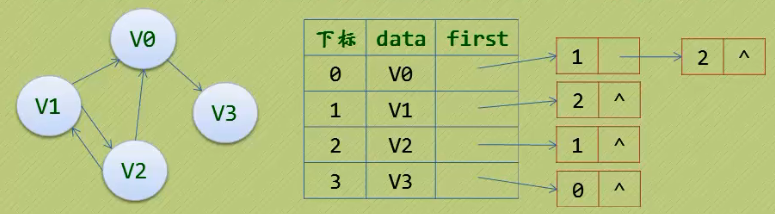
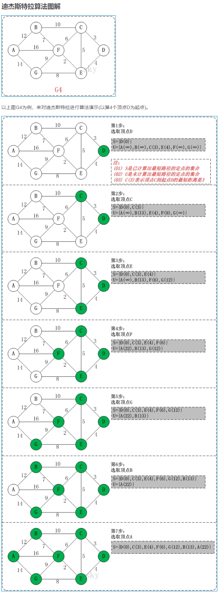

**图（Graph）**是由顶点的有穷非空集合和顶点之间边的集合组成，通常表示为：G（V，E），其中G表示一个图，V是图G中**顶点的集合**，E是图G中**边的集合**。  

翻译：  
边：Edge  
弧：Arc  
顶点：vertex  
图：graph  

需要注意的几个地方：  
* 线性表中我们把数据元素叫**元素(Elem)**，树中叫**结点(Node) **，在图中数据元素我们称之为**顶点(Vertex)**  
* 线性表中，相邻的数据元素之间具有线性关系，树结构中，相邻两层的结点具有层次关系，而图结构中，任意两个顶点之间都可能有关系，顶点间的逻辑关系用边来表示，边集可以是空的。  

# 1 图的定义和术语  
**无向边(Edge)**：若顶点Vi到Vj之间的边没有方向，则称这条变为无向边，用无序偶（Vi，Vj）来表示。  
**有向边(Arc)**：若从顶点Vi到Vj的边有方向，则称这条边为有向边，也称为**弧(Arc)**，用有序偶 <Vi，Vj> 来表示，Vi称为弧尾，Vj称为**弧头（箭头为头）**。   
**简单图：**不存在顶点到其自身的边，且同一条边不重复出现。  
**无向完全图：**在无向图中，如果任意两个顶点之间都存在边。含有n个顶点的无向完全图有n*(n-1)/2条边。  
  

**有向完全图：**如果任意两个顶点之间都存在互为相反的两条弧。含有n个顶点的有向完全图有n*(n-1)条边。  
  

**稀疏图和稠密图：**这里的稀疏和稠密是模糊概念，都是相对而言的，通常认为边或弧数小于n*logn(n是顶点的个数)的图称为稀疏图，反之称为稠密图。  

有些图的边或弧带有与它相关的数字，这种与图的边或弧相关的数叫做**权(weight)**，这种带权的图通常称为**网(network)**  
   

**子图(subgraph)：**假设有两个图G1 =(V1，E1)和G2=(V2，E2)，如果V2≦V1且E2≦E1，则称G2是G1的子图。

**顶点的度**  
无向图中，若有边(Vi，Vj)，则称Vi与Vj互为邻接点，(Vi，Vj)是与顶点Vi和Vj相关联的边。与顶点相关联边的条数，称为**顶点的度**。

有向图中，以顶点Vi为弧尾的弧个数，称为**顶点Vi的出度**，记为OD(Vi)，以顶点Vi为弧头的弧个数称为**顶点Vi的入度**，记为ID(Vi)。顶点Vi的度=OD(Vi)+ID(Vi)。

 

# 2 图的存储结构


## 2.1 邻接矩阵(MGraph)

**基本思想：对于有n个顶点的图，用一维数组vexs[n]  存储顶点信息，用二维数组 A[n] [n] 存储顶点之间关系的信息。该二维数组称为邻接矩阵。**

在邻接矩阵中，以顶点在vexs数组中的下标代表顶点，邻接矩阵中的元素A[i][j]存放的是顶点i到顶点j之间关系的信息。

### 2.1.1 无向邻接矩阵
  

```c
#define MaxVertexNum 100 // 最大顶点数，应由用户定义 
typedef char VertexType; // 顶点类型
typedef int EdgeType;  // 边上的权值类型
 
typedef struct
{
    VertexType vertexs[MaxVertexNum]; 			// 顶点表
    EdgeType edges[MaxVertexNum][MaxVertexNum]; // 邻接矩阵，可看作边表
    int numOfVertex;// 当前的顶点数
    int numOfEdge;  // 当前的边数
}MGragh;
```

### 2.1.2 有向邻接矩阵
  


## 2.2 邻接表和逆连接表(Adjacency List)
**邻接表(Adjacency List)**是图的一种链式存储结构，它既可以存放有向图也可以存放无向图  
它关注的是点。  

### 2.2.1 无向邻接表

图中**顶点用一个一维数组存储**，当然，顶点也可以用单链表来存储，不过数组可以较容易地读取顶点信息，更加方便。  
图中每个顶点Vi的所有邻接点构成一个线性表，**由于邻接点的个数不确定，所以我们选择用单链表来存储**。  
  

无向邻接表的代码表示：
```c
#define MAX_VERTEX_NUM 20  // 顶点数
typedef char DataType;	   // 顶点保存数据的类型

// 边类型
typedef struct EdgeType {
	int	VertexIndex;		   // 顶点的下表
	struct EdgeType* nextEdge; // 指向下一条边
}EdgeType;

// 顶点类型
typedef struct VertexType {
	DataType data;
	EdgeType* firstEdge;	// 指向第一条边
}VertexType;

typedef struct {
	VertexType vertexs[MAX_VERTEX_NUM];
    int	numOfVertex; // 当前顶点数
    int numOfEdge;   // 当前边数
}ALGraph; // 无向图的邻接表
```


### 2.2.2 有向图的邻接表

若是有向图，邻接表结构也是类似的，把定点当弧尾建立的邻接表，这样容易得到每个顶点的出度。

  

对于**带权值**的网图，**可以在边表结点定义中再增加一个数据域来存储权值即可**。

  

有向图的邻接表的代码表示：
```c
#define MAX_VERTEX_NUM 20  // 顶点数
typedef char DataType;	   // 顶点保存数据的类型

// 弧类型
typedef struct ArcType {
	int	VertexIndex;		// 顶点的下表
    int Weight;				// 权值
	struct ArcType* nextArc; // 指向下一条边
}ArcType;

// 顶点类型
typedef struct VertexType {
	DataType data;
	ArcType* firstArc;	// 指向第一条边
}VertexType;

typedef struct {
	VertexType vertexs[MAX_VERTEX_NUM];
	int	numOfVertex; // 当前顶点数
    int numOfArc;   // 当前弧数
}ALGraph; // 无向图的邻接表
```

### 2.2.3 有向图的逆邻接表

有时为了确定顶点的入度或以顶点为弧头的弧，我们可以建立一个有向图的逆邻接表。

   

有向图的逆邻接表和有向图的邻接表的代码表示是一致的，区别仅是存放弧的方向调转过来而已。

## 2.3 十字链表（有向图）
  **十字链表(Orthogonal List)**是**有向图**的另一种存储结构。可以看成是将**有向图**的邻接表和逆链接表结合起来得到的一种链表。

 在十字链表中，对应于有向图中每一条弧有一个结点，对应于每个顶点也有一个结点。

这些**顶点**的结构如下：
  

边表结点结构：
  

  

 

```c
#define MAX_VERTEX_NUM 20
typedef char DataType;

typedef struct ArcType {
	int tailVertex, headVertex;
	struct ArcType* tailLink, * headLink;
	int Weight; // 权值，如果需要保存跟多的信息则改成指针的形式
}ArcType;

typedef struct VertexType {
	DataType data;
	ArcType* firstIn;
	ArcType* firstOut;
}VertexType;

typedef struct {
	VertexType vertexs[MAX_VERTEX_NUM];
	int numOfVertex;
	int numOfArc;
}OLGraph;
```


## 2.4 邻接多重表（无向图）

邻接多重表是**无向图**的另一种链式存储结构。和十字链表类似，每一条边用一个结点表示，它由6个域组成：

```c
#define MAX_VERITEX_NUM 20
typedef enum {unvisited, visited} VisitIf;
typedef struct EBox{
    VisitIf        mark;            // 访问标记
    int            ivex,jvex;        // 该边依附的两个顶点的位置
    struct EBox *ilink,*jlink;    // 分别指向依附这两个顶点的下一条边
    InfoType    *info;            // 该边信息指针
}EBox;
 
typedef struct VexBox{
    VertexType data;
    EBox        *firstedge;        // 指向第一条依附该顶点的边
}VexBox;
 
typedef struct{
    VexBox    adjmulist[MAX_VERITEX_NUM];
    int        vexnum,edjenum;        // 无向图的当前顶点数和边数
}AMLGraph;
```


# 3 图的遍历

从图的某一个顶点出发访遍途中的其余顶点，且使每一个顶点仅被访问一次，这一过程叫做图的遍历。  


## 3.1 深度优先遍历（DFS）

该方法类似于树的前序遍历。

假设初始状态是图中所有顶点未曾被访问，则深度优先搜索从图像中通过某个顶点v出发。访问次顶点，然后依次从v的未被访问的邻接点出发深度优先遍历图，直至途中所有和v有路径相通的顶点都被访问到；若此时图中尚有顶点未被访问，则另选途中一个未曾被访问的顶点作起点，重复上述过程，直至图中所有顶点都被访问到为止。

  


## 3.2 广度优先遍历（BFS）

类似于树的层序遍历，要实现对图的广度遍历，可以利用**队列**来实现。  
   
  


# 4 最小生成树

给定一个**带权**的无向连通图，如何选取一棵生成树，使树上所有边上权的总和为最小，这叫**最小生成树.**

## 4.1 普里姆算法

## 4.2 克鲁斯卡尔算法

# 5 最短路径

在网图和非网图中，最短路径的含义是不同的。  
* 网图是两顶点经过的边上权值之和最小的路径。   
*  非网图是两顶点之间经过的边数最少的路径。  
把路径起始的第一个顶点称为源点，最后一个顶点称为终点。  

## 5.1 迪杰斯特拉算法

迪杰斯特拉算法求的是一个顶点到所有顶点的最短路径。  
  
该算法不是一下子就求出V0~V8的最短距离，而是一步步求出它们之间顶点的最短路径，过程中都是基于已经求出的最短路径的基础上，求得更远顶点的最短路径，最终得到需要的结果。

## 5.2 弗洛伊德算法
弗洛伊德算法是求所有顶点到所有顶点的最短路径。