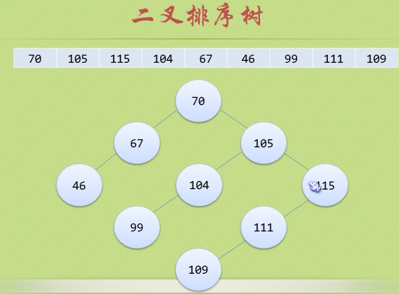

**查找表（Search Table）是由同一类型的数据元素构成的集合。由于“集合”中的数据元素之间存在着完全松散的关系，因此查找表是一种非常灵活的数据结构。**

--- 根据查过过程是否需要对标进行操作进行分类：

**静态查找：**数据集合稳定，不需要添加，删除元素的查找操作。

**动态查找：**数据集合在查找的过程中需要对表做修改操作（如添加或删除元素的查找操作）

# 一 静态查找表

**静态查找表**在查找的过程中不改变表的状态——不插不删。他适合用于不变动或不常变动的表的查找。如高考成绩表、本单位职工信息表等。下面分别介绍**顺序查找**，**有序表的折半查找**，**静态树表的查找**。

## 1.1 顺序表的查找

从表的一端开始，逐个把每条记录的关键字值与给定值k进行比较。若某个记录关键字值与给定值k相等，则查找成功，返回找到的记录位置。反之，若已查找到表的另一端，仍未找到关键字值与给定值相等，则查找不成功，返回0。**算法复杂度：O(n)**  
```c
//常规例子
// R - 表
// n - 表的大小
// key - 待对比的关键字
int SqSearch(ElemType R[],int n,ElemType key){
   for(int i=1;i<=n;i++){
      if(key == R[i]){
          return i;
      }
   }
   return 0;
}
```

## 1.2 有序表的查找

**折半查找（二分查找）**

如果查找表已经按关键字（递增或递减）排好序，可以采用二分查找法进行查找（这是一种特殊的按比例查找）。注意：  

1. <font color=red>只适用于已经排好的顺序表</font>  
2. 二分查找只适用于顺序存储结构，不适用于线性链表结构。二分查找特别适用于那种一经建立就很少改动，而又经常需要查找的线性表。  
      算法复杂度：O(n)  

```c
// R - 已排序的顺序表
// n - 表的大小
// key - 待比较的关键字
int BinSearch(ElemType R[],int n,ElemType key){
    int low=0,high=n-1,mid;
    while(low<=high)
    {
        mid = (low+high)/2;
        if(R[mid] == key)
            return mid;
        else if(R[mid]>key)
            high = mid -1;
        else
            low = high +1;
    }
    return -1;
}
```

**1.3 按值查找（按比例查找）**

和折半查找算法类型，区别是折半查找是每次和中间值比较，折去一半，而按值查找则根据数在查找段可能的位置进行定位。**(还是基于有序序列的查找)**  
**优点：**在数据分布均匀的线性表中查询，性能比折半查找高  
**缺点：**当数据分布极端不均匀，性能会比折半查找低   
```c
int ValueSearch(ElemType R[],int n,ElemType key)
{
    int low=0,high=n-1,mid;
    while(low<=high)
    {
        // 计算比例
        mid = ((key - R[low])/(R[high] - R[low]))*(high-low) + low;
        if(R[mid] == key)
            return mid;
        else if(R[mid]>key)
            high = mid -1;
        else
            low = high +1;
    }
    return -1;
}
```

## 1.4 斐波那契查找
（黄金比例查找 0.618：1）


## 1.6 分块查找

**分块查找**又称为**索引顺序查找，**或者**线性索引查找**，这是顺序查找的一种改进方法。
首先把表长为n的线性表分成b块，前b-1块记录个数为s=n/b，第b块的记录个数小于等于s。在每一块中，结点的存放不一定有序，但块与块之间必须分块有序（假定按结点的关键值递增有序），即指后一块中所有记录的关键字值有应比前一块中所有记录的关键字值大。  
为实现分块检索，还需要建立一个索引表，索引表每个元素对应一个块，其中包括该块内最大关键字值和块中第一个记录位置的地址指针。显然这个索引顺序表是一个递增有序表。  

  

```c
//索引表结点的数据结构
# define MaxIndex n
typedef struct
{
    KeyType key;
    int link;
}IdxType;
//原顺序表A,索引表index,分块数b,查找关键字k,顺序表A大小n
int IndexSearch(SqList A[],IdxType index[],int b,int keyType k,int n)
{
    //分块查找关键字k的记录,索引表为index[0...b-1]
    //先对索引表进行二分查找
    int low=0,high=b-1,mid,i;
    int s = n/b;//每块记录数
    while(low<=high){
        mid=(low+high)/2;
        if(index(mid].key <k)
            low = mid+1;
        else
            high = mid-1;
    }
    if(low <b)
    {   //在顺序表中顺序查找
        for(i=index[low].link; i<=index[low].link +s-1 && i<n; i++)
        {
            if(A[i] ==k)
                return i;
        }
    }
    return -1;
}
```


# 二 动态查找表


# 2.1 二叉排序树

  

**二叉排序树（Binary Sort Tree**）又称**二叉查找树（Binary Search Tree）**，它或者是空树，或者是满足如下性质的二叉树：  
(1) 若他的左子树非空，则左子树上所有结点的值均小于根结点的值  
(2) 若他的右子树非空，则右子树上所有结点的值均大于根结点的值  
(3) 它的左右子树本身又各是一棵二叉排序树**(递归)**  
**二叉排序树有一个特性：**数据集合本身是无序的，但二叉排序树的**中序序列(LDR)**是递增序列(有序的)  


### 2.1.1 二叉排序树的查找

```c
// 二叉树的二叉链表结点结构定义
typedef int ElemType;
typedef struct BiTNode
{
    ElemType data;
    struct BiTNode *lchild, *rchild;
}BITNode, *BiTree;

// 递归查找二叉排序树T中是否存在key
// 指针f指向T的双亲，初始值未NULL
// 若查找成功，指针p指向该数据元素结点，并返回TRUE
// 否则指针p指向查找路径上访问的最后一个结点并返回FALSE
status SearchBST(BiTree T, int key, BiTree f, BiTree *p)
{
    if(!T){ // 查找不成功
        *p = f;
        return FALSE;
    } else if(key == T->data){ // 查找成功
        *p = T;
        return TRUE;
    } else if(key < T->data){
        // 查找左子树
        return SearchBST(T->lchild, key, T, p); 
    }else{
        // 查找右子树
        return SearchBST(T->rchild, key, T, p); 
    }
}
```


### 2.1.2 二叉排序树的插入  

基本思想：

若二叉排序树为空，将插入的结点作为根节点；否则将待插入结点的关键字值和根结点关键字值进行比较，若小于，则作为跟结点的左子树插入，否则作为右子树插入。

```c
// 插入key并返回TRUE，否则返回FALSE
status InsertBST(BiTree *T, int key)
{
    BiTree p,s;
    if(!SearchBST(*T,key, NULL,&p))
    {
        s = (BiTree)malloc(sizeof(BiTNode));
        s->data = key;
        s->lchild = s->rchild = NULL;
        if(!p){
            *T = s;         // 找不到，插入s为新的根结点
        }else if( key < p->data){
            p->lchild = s; // 插入s为左孩子
        }else{
            p->rchild = s; // 插入s为右孩子
        }
        return TRUE;
    }else{
        return FALSE;  
    }
}
```

 

### 2.1.3 二叉排序树的删除  
根据删除的结点又三种情况进行分析：
- 叶子结点
- 仅有左或右子树的结点
- 左右子树都有结点
```c
// 若二叉排序树T中存在关键字等于key的数据元素时，则删除该数据元素结点并返回TRUE，否则返回FALSE
status DeleteBST(BiTree *T, int key)
{
    if(!*T){
        return FALSE;
    }else{
        if(key == (*T)->data) // 找到
            return Delete(T);
        else if(key < (*T)->data)
            return DeleteBST(&(*T)->lchild, key); // 查找左子树
        else
            return DeleteBST(&(*T)->rchild, key); // 查找右子树
    }
}
// 从二叉排序树中删除结点p，并重接它的左或右子树
status Delete(BiTree *p)
{
    BiTree q,s;
    if( (*p)->rchild == NULL) // 右子树为空则只需重接它的左子树
    {
        q = *p; *p = (*p)->lchild; free(q);
    }
    else if( (*p)->lchild == NULL) // 只需重接它的右子树
    {
        q = *p; *p = (*p)->rchild; free(q);
    }
    else 
    {	// 左右子树都不为空
        q = *p; s = (*p)->lchild;
        while( s->rchild)         // 转左，然后向右到尽头
        {
            q = s; s = s->rchild;
        }
        (*p)->data = s->data;     // s指向被删结点的直接前驱
        
        if(q !=*p)
            q->rchild = s->lchild; // 重接q的右子树
        else
            q->lchild = s->lchild; // 重接q的左子树
        free(s);
    }
    return TRUE;
}
```


## 2.2 平衡二叉树

**平衡二叉树**（Balanced Binary Tree）又被称为AVL树（有别于AVL算法），且具有以下性质：它是一 棵空树或它的左右两个子树的高度差的绝对值不超过1，并且左右两个子树都是一棵平衡二叉树。这个方案很好的解决了二叉查找树退化成链表的问题，把插入，查找，删除的时间复杂度最好情况和最坏情况都维持在O(logN)。但是频繁旋转会使插入和删除牺牲掉O(logN)左右的时间，不过相对二叉查找树来说，时间上稳定了很多。
  

平衡二叉树大部分操作和二叉查找树类似，主要不同在于插入删除的时候平衡二叉树的平衡可能被改变，并且只有从那些插入点到根结点的路径上的结点的平衡性可能被改变，因为只有这些结点的子树可能变化。

**平衡二叉树不平衡的情形：**

把需要重新平衡的结点叫做α，由于任意两个结点最多只有两个儿子，因此高度不平衡时，α结点的两颗子树的高度相差2.容易看出，这种不平衡可能出现在下面4中情况中：  
1.对α的左儿子的左子树进行一次插入   
2.对α的左儿子的右子树进行一次插入  
3.对α的右儿子的左子树进行一次插入  
4.对α的右儿子的右子树进行一次插入  
 
情形1和情形4是关于α的镜像对称，二情形2和情形3也是关于α的镜像对称，因此理论上看只有两种情况，但编程的角度看还是四种情形。

第一种情况是插入发生在“外边”的情形（左左或右右），该情况可以通过一次单旋转完成调整；第二种情况是插入发生在“内部”的情形（左右或右左），这种情况比较复杂，需要通过双旋转来调整。  
调整措施：  
一、单旋转  
   
上图是左左的情况，k2结点不满足平衡性，它的左子树k1比右子树z深两层，k1子树中更深的是k1的左子树x，因此属于左左情况。

为了恢复平衡，我们把x上移一层，并把z下移一层，但此时实际已经超出了AVL树的性质要求。为此，重新安排结点以形成一颗等价的树。为使树恢复平衡，我们把k2变成这棵树的根节点，因为k2大于k1，把k2置于k1的右子树上，而原本在k1右子树的Y大于k1，小于k2，就把Y置于k2的左子树上，这样既满足了二叉查找树的性质，又满足了平衡二叉树的性质。这种情况称为单旋转。


二、双旋转

对于左右和右左两种情况，单旋转不能解决问题，要经过两次旋转。
   
对于上图情况，为使树恢复平衡，我们需要进行两步，第一步，把k1作为根，进行一次右右旋转，旋转之后就变成了左左情况，所以第二步再进行一次左左旋转，最后得到了一棵以k2为根的平衡二叉树。

 

AVL树的删除操作：

同插入操作一样，删除结点时也有可能破坏平衡性，这就要求我们删除的时候要进行平衡性调整。

删除分为以下几种情况：

首先在整个二叉树中搜索要删除的结点，如果没搜索到直接返回不作处理，否则执行以下操作：

1.要删除的节点是当前根节点T。

如果左右子树都非空。在高度较大的子树中实施删除操作。

分两种情况：

(1)、左子树高度大于右子树高度，将左子树中最大的那个元素赋给当前根节点，然后删除左子树中元素值最大的那个节点。

(1)、左子树高度小于右子树高度，将右子树中最小的那个元素赋给当前根节点，然后删除右子树中元素值最小的那个节点。

如果左右子树中有一个为空，那么直接用那个非空子树或者是NULL替换当前根节点即可。

2、要删除的节点元素值小于当前根节点T值，在左子树中进行删除。

递归调用，在左子树中实施删除。

这个是需要判断当前根节点是否仍然满足平衡条件，

如果满足平衡条件，只需要更新当前根节点T的高度信息。

否则，需要进行旋转调整：

如果T的左子节点的左子树的高度大于T的左子节点的右子树的高度，进行相应的单旋转。否则进行双旋转。

3、要删除的节点元素值大于当前根节点T值，在右子树中进行删除。


## 2.3 多路查找树

之前我们了解的树，都是一个节点可有多个孩子，但是它自身只能存储一个元素。二叉树限制更多，节点最多只能有两个孩子。一个节点只能存储一个元素，在元素非常多的时候，就是的要么树的深度非常大(树的高度非常大)，这就使得内存存储次数非常多。
试想一下，为了要在一个拥有几十万个文件的磁盘中查找一个文本文件，你设计的算法需要读取磁盘上万次，还是读取几十次，这是有本质差异的。此时，为了降低对外存储设备的访问次数，就需要更好的数据结构来处理这样的问题。为此，引入了B树(多路查找树)的概念。  
**B树是一种平衡的多路搜索树，多用于文件系统、数据库的实现。**

## 3.3.1 2-3树
2-3树，也称为3阶B树。

1) 查找

2) 插入

3) 删除
* 3结点变2结点
* 

## 3.3.2 B树


# 4 散列表(哈希表)
散列表(hash table) ，也叫哈希表，是根据关键码而直接进行访问的数据结构。也就是说，它通过把关键码映射到表中一个位置来访问记录，以加快查找的速度。这个映射函数叫做散列函数，存放记录的数组叫做**散列表**。  

## 常见散列表的构造方法

构造散列函数的两个基本原则：  
> 计算简单
> 计算出来的散列分布均匀

**直接定址法**  
此类函数取关键码的某个线性函数值作为散列地址：hash ( key ) = a * key + b      { a, b为常数 }
这类散列函数是一对一的映射，一般不会产生冲突。

但是，它要求散列地址空间的大小与关键码集合的大小相同。

**数字分析法**  
构造：对关键字进行分析，取关键字的若干位或其组合作哈希地址。
适于关键字位数比哈希地址位数大，且可能出现的关键字事先知道的情况。
例：  有80个记录，关键字为8位十进制数，哈希地址为2位十进制数

**平方取中法**
取关键字平方后中间几位作哈希地址。适于关键字位数不定情况。
具体方法：先通过求关键字的平方值扩大相近数的差别，然后根据表长度取中间的几位数作为散列函数值。又因为一个乘积的中间几位数和乘数的每一位都相关，所以由此产生的散列地址较为均匀


**折叠法**
此方法把关键码自左到右分成位数相等的几部分，每一部分的位数应与散列表地址位数相同，只有最后一部分的位数可以短一些。
把这些部分的数据叠加起来，就可以得到具有该关键码的记录的散列地址。有两种叠加方法：
移位法 — 把各部分的最后一位对齐相加；
分界法 — 各部分不折断，沿各部分的分界来回折叠，然后对齐相加，将相加的结果当做散列地址。
一般当关键码的位数很多，而且关键码每一位上数字的分布大致比较均匀时，可用这种方法得到散列地址。

**除留余数法**
设散列表中允许的地址数为 m, 散列函数为：
 hash ( key ) = key % p    (p <=  m)

若p取100，则关键字159、259、359互为同义词。我们选取的p值应尽可能使散列函数计算得到的散列地址与各位相关，根据经验，p最好取一个不大于 m，但最接近于或等于 m 的质数 p,  或选取一 个不小于 20 的质因数的合数作为除数（比如8 = 2*2*2，2 是 8 的质因数，8 是合数）

**随机数法**
选择一个随机函数，取关键字的随机函数值为它的散列地址，即 hash(key) = random(key) ；其中random为伪随机函数，但要保证函数值是在0到m-1之间。

## 处理散列冲突的方法

开放定址法：当冲突发生时，使用某种探测技术在散列表中形成一个探测序列。沿此序列逐个单元地查找，直到碰到一个开放的地址（即该地址单元为空）为止，然后插入。
基本公式：
$$
fi(key) = (f(key)+di) MOD m (di=1,2,3,......,m-1)，di可视情况改变
$$

再散列函数法：多个散列函数

链地址法（拉链法）：相同地址用链表

公共溢出区法：基本表+溢出表


