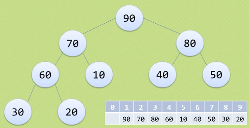
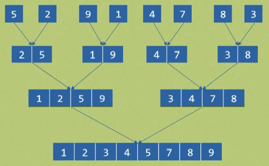

# 1. 基本概念

&ensp;&ensp;**排序**就是把**一组记录或数据元素**的无序序列**按照某个关键字**递增或递减的次序**重新排列**的过程,其**主要目的就是实现快速查找**。
排序的依据是关键字之间的大小关系,那么对同一记录集合,针对不同的关键字进行排序,可以得到不同序列。

**增排序和减排序**  
如果排序结构是按照关键字从小到大的次序排列的,即是**增排序**,反之是**减排序**

**稳定的稳定性**  
假设Ri和Rj<font color=red>具有相同的关键字</font>,在排序前的序列中Ri领先与Rj（即i<j）,若在排序后的序列中Ri仍领先与Rj则这种排序方法是稳定的，反之，则是不稳定的。

**内部排序与外部排序**  
排序过程中全部记录都在内存中进行排序,称为**内部排序**,反之,称为**外部排序**。

**影响排序算法性能的几个要素**  

* 时间性能：可以用记录之间关键字的比较次数与记录的移动次数来衡量  
* 辅助空间：算法在执行时所需的附加存储空间,也就是临时存储数据的内存使用情况  
* 算法的复杂性：<font color=green>注意这里说的算法本身的复杂度,而不是时间复杂度</font>。  


# 2. 交换排序

<font color=blue>**利用交换记录的位置进行排序**</font>的方法称为**交换排序**。  

基本思想：两两比较待排序记录的关键字,如果逆序就进行交换,直到所有记录都排好位置。


## 2.1 冒泡排序

冒泡排序的基本思想：两两相邻记录的关键字,如果反序则交换,直到没有反序的记录为止。  
注意：  
在该算法中，外层循环控制排序的执行趟数，内层循环用于控制在一趟冒泡排序中相邻记录的比较和交换。
如果有n个元素需要比较n-1次，每一轮减少1次比较,既然叫做冒泡排序，那就是从下往上两两比较，所以看上去就跟泡泡往上冒一样。

```c
void BubbleSort(DataType R[], int n){
    DataType temp;
    bool isSorted = true;   // 已经有序
    int compare_count = 0, exchange_count = 0;
    for(int i = n - 1; i > 0; i--){
        isSorted = true;
        for(int j = 0; j < i; j++){
            compare_count++;
            if(R[j] > R[j+1]){
                isSorted = false;
                temp = R[j];
                R[j] = R[j+1];
                R[j+1] = temp;
                exchange_count++;
            }
        }
        if(isSorted)
            break;
    }
    printf("冒泡排序: 比较[%d] 交换[%d]\n", compare_count, exchange_count);
}
```


## 2.2 快速排序(分区交换排序)  

快速排序又称为**分区交换排序**，是对冒泡排序算法的改进，是一种基于分组进行互换的排序算法。  
快速排序的基本思想：   
通过一趟排序将要排序的数据分割成独立的两部分，其中一部分的所有数据都比另外一部分的所有数据都要小，然后再按此方法对这两部分数据分别进行快速排序，整个排序过程可以递归进行，以此达到整个数据变成有序序列。

<font color=orange>**通俗的说就是，取第一数做比较标准temp，循环从右边取出比temp小的数，从左边取出比temp大的数，当完成一趟之后，把数据切成两半，在递归执行。**</font>

```c
void QuickSort(ElemType R[], int left, int right)
{
    int i = left,j = right;
    ElemType temp;
    if(left < right)
    {
        temp = R[left];
        while(i!=j){
            while(j>i && R[j]>=temp) j--;
            if(i<j){
                R[i] = R[j];
                i++;
            }
 
            while (i<j && R[i]<=temp) i++;
            if(i<j){
                R[j] = R[i];
                j--;
            }
        }
        R[i] = temp;
        QuickSort( R, left, i-1);
        QuickSort( R, i+1, right);
    }
}
```


# 3. 选择排序  

选择排序算法就是通过n-i次关键字间的比较，每次从n-i+1个记录中选出关键字最小的记录，并和第i（1<=i<=n）个记录交换。  

## 3.1简单选择排序  
简单选择排序是选择排序中最简单直观的一种方法。
> (1) 每次从待排记录中选出关键字最小的记录  
> (2) 再将它与待排列序列第一位置的记录交换后,将其“插入”已排序记录序列（初始为空）
> (3) 不断重复（1）和（2）。  
> (4) 时间复杂度:O(n^2)  
> **该算法的效率比冒泡排序高一些**

```c
//选择排序(默认从小到大排序)
//思想：每次从待排序列选出最小的元素
void SelectSort(ElemType R[], int n)
{
  int i,j,min;
  ElemType temp;
  for( i=0; i<n-1; i++){//n-1次
    min = i;
    for( j=i+1; j<n; j++)
    {
      if(R[j] < R[min])
        min = j;
    }
 
    if( i!= min)
    {  //如果最小不是初始值，交换
      temp = R[min];
      R[min] = R[i];
      R[i] = temp;
    }
  }
}
```

## 3.2 堆排序

堆排序使用的堆是具有以下性质的**完全二叉树**。  
--每个节点的值都大于或等于其左右孩子的值（大顶堆）—— 用于增排序  
--每个节点的值都小于或等于其左右孩子的值（小顶堆）—— 用于减排序  
根节点一定是堆中所有节点最大或者最小者，如果按照层序遍历的方式给节电从1开始编号，则结点之间满足如下关系（注意这公式，前面是大顶堆，后面是小顶堆）：  
  

堆排序就是利用堆进行排序的算法，它的基本思想是：  

- 将待排序的序列构造成一个大顶堆 
- 此时，整个序列的最大值就是堆顶的结点。将他移走（就是将其与堆数组的末尾元素交换，此时末尾元素就是最大值）  
- 然后将剩余的n-1个序列重新构造成一个堆，这样就会得到n个元素中的最大值  
- 如此反复执行，便能得到一个有序序列。  
    

```C
// 构造大顶堆或小顶堆(从定点S往下梳理它和它的子树，使之形成一个子大顶堆)
void HeapAdjust(int k[], int s, int n)
{
    int temp = k[s];
 
    // 注意这里的循环，因为如果有不满足进行交换了，需要继续对下面的子树进行交换
    for(int i=2*s; i <= n; i*=2 )
    {
        if( i < n && k[i] < k[i+1] ) // i指向两个子树中的较大值
            i++;
 
        if( temp >= k[i] ) 
            break;
 
        k[s] = k[i]; 
        s = i;
    }
 
    k[s] = temp;
}

// 堆排序操作
void HeapSort(int k[], int n)
{
    // 从中间往上构建大顶堆
    for(int i=n/2; i > 0; i-- )
        HeapAdjust(k, i, n);
 
    for(int i=n; i > 1; i-- )
    {
        swap(k, 1, i); // 把首尾两个互换
        HeapAdjust(k, 1, i-1); // 重新构造大顶堆
    }
}
```


# 4. 插入排序

插入排序的基本思想：    
每一次将一个待排序的记录，按其关键字大小**插入到前面已经排好的子表中**的适当位置，直到全部记录插入完成位置。  
也就是说,<font color=blue>将待序列表分成**左右两部分**,**左边为有序表（有序序列）,右边为无序表（无序序列）**。整个排序过程就是将右边无序表中的记录逐个插入到左边的有序表中，构成新的有序序列</font>。


## 4.1 直接插入排序

直接插入排序基本原理:    
  顺序从无序表中取出记录Ri（1<=i<=n）,与有序表中记录的关键字逐个进行比较,找出其应该插入的位置,再将此位置及其之后的所有记录依次向后顺序移一个位置,将记录Ri插入其中。**(左--有序，右--无序)**

**优点：排序算法简单，容易实现  
缺点：效率不高，待排序序列记录数n很大时不宜使用该算法。**  

```c
//直接插入排序(默认从小到大), R是数组头指针，n是数组大小
void InsertSort(int R[], int n)
{
    int i,j;
    int temp;    
    for( i=1; i<=n-1; i++){
        if( R[i] < R[i-1]){ //如果需要交换
            temp = R[i];   //保存R[i],注意i是位置
            for( j=i-1; R[j]>temp; j--)
                R[j+1] = R[j];
            R[j+1] = temp;
        }
    }
}
```


## 4.2 折半插入排序

由于插入排序的基本操作是在一个**有序表**中进行查找和插入两个操作，所以，这个“查找”操作可以利用“折半查找”来实现，由此进行的插入排序称之为**折半插入排序**(Binary Insertion Sort)。

```c
//默认从小到大(n是数组大小)
void Insert_halfSort(ElemType R[], int n)
{
    int i,j,low,high,mid;
    for(i=2;i<=n;i++)
    {
        R[0] = R[i];
        low = 1;
        high = i -1;
        while(low<=high)
        {
            mid = (low+high)/2;
            if( R[0] > R[mid] )
                low = mid +1;
            else
                high = mid -1;
        }
        for( j=i-1; j>=high+1; --j)
            R[j+1] = R[j];
        R[high+1] = R[0];
    }
}
```


## 4.3 希尔排序

&ensp;&ensp;由于直接插入排序算法的时间性能取决于数据的初始特性,一般情况下,时间复杂度为O(n^2)。当时当待排序列基本有序时,时间复杂度则为O(n)。  
&ensp;&ensp;因此,若能在一次排序前将排序序列调整为基本有序,则排序的效率就会大大提高。  

希尔排序的基本思想：  
&ensp;&ensp;先将整个待排记录序列分割成若干小组（自序列）,分别在组内进行直接插入排序,待整个序列中的记录“基本有序”时,再对全体记录进行一次直接插入排序。
（其实就是间隔直接插入排序，实现基本有序，最后来一个插入排序）

```c
void ShellSort(ElemType R[],int n)
{
    int i,j;
    ElemType temp;
    int gap = n;
    do
    {
        gap = gap/3+1;    //选取跨度
        for( i=gap; i<=n-1; i+=gap)
        {
            if( R[i] < R[i-gap])  //如果需要交换
            {
                temp = R[i]; //保存R[i]
                for( j=i-gap; j /= 0 && R[j]>temp; j-=gap)
                    R[j+gap] = R[j];
                R[j+gap] = temp;
             }
        }
   }while (gap>1);
}
```


# 5.归并排序(Merge Sort)

“归并”的含义是将两个或两个以上的, **<font color=green>有序表</font>合并成一个新的有序表**。

二路归并排序的基本思想：  
将有n个记录的待排序列看作n个有序子表，每个有序子表的长度为1，然后从第一个有序子表开始，把相邻的两个有序子表两两合并，得到n/2个长度为2或1的有序子表（当有序子表的个数为奇数时，最后一组合并得到的有序子表长度为1），这一过程称为一趟归并排序。再将有序子表两两归并，如此反复，直到得到一个长度为n的有序表为止。上述每趟归并排序都需要将相邻的两个有序子表两两合并成一个有序表，这种归并方法称为二路归并排序。


```c
// 归并排序
void MergeSort(DataType R[], int n){
    
    if(n > 1){
        int *list1 = R;
        int list1_size = n/2;
        int *list2 = R + n/2; 
        int list2_size = n - n/2;
 
        // 把序列分成两个排序
        MergeSort(list1, list1_size);
        MergeSort(list2, list2_size);
 
        // 然后再合并两部分在一起
        Mergeing(list1, list1_size, list2, list2_size);
    }
}

#define  MAX_SIZE 100
void Mergeing(DataType R1[], int size1, DataType R2[], int size2)
{
    int i = 0,j = 0,k = 0;
    DataType temp[MAX_SIZE];
 
    while (i < size1 && j < size2)
    {
        if(R1[i] < R2[j])
            temp[k++] = R1[i++];
        else
            temp[k++] = R2[j++];
    }
    for(; i < size1; i++)
        temp[k++] = R1[i];
    for(; j < size2; j++)
        temp[k++] = R2[j];
 
    for(int m = 0; m < size1 + size2; m++)
        R1[m] = temp[m];
}
```